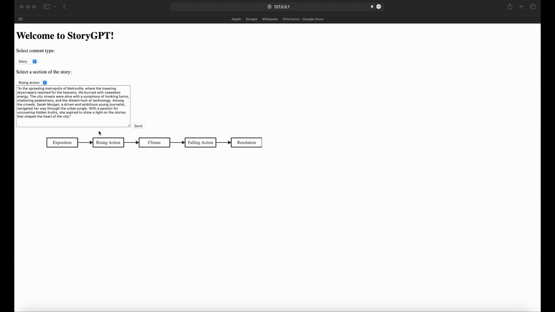
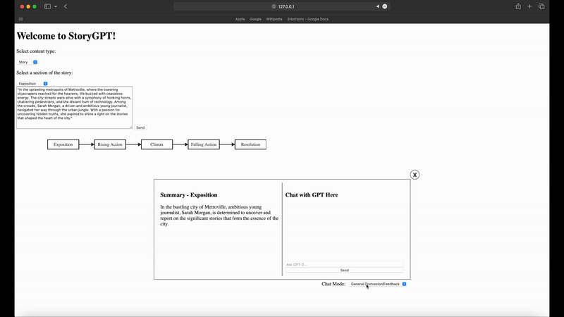
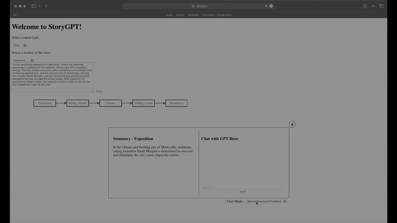

# StoryGPT: A Storytelling Assistant using OpenAI's GPT-4 

StoryGPT is a web application that leverages the OpenAI API to assist users in receiving feedback, brainstorming new ideas, or identifying plot holes for their short story, novel, or script. Whether you're drafting a screenplay or brainstorming plot points, StoryGPT is here to act as a fresh set of "eyes" for your work.

## Tech Stack

- **Frontend**: HTML, CSS, JavaScript
- **Backend**: Python (Flask)
- **API**: OpenAI API

## Features

- **Interactive Plot Point Selection**: Select different sections of your story (exposition, rising action, climax, falling action, resolution), input text for this section of your story (actual script/novel or outline), and receive a summary of that section in a flow chart for your reference.
- **Chat with GPT-4**: Interact directly with GPT-4. The chatbot is aware of the section of the story you're discussing, the content type (story or outline), and the chat mode you're in (see below bullet point).
- **Dynamic Chat Modes**: Toggle between different chat modes including General Feedback, Plot Hole Detection, Character Development, and Brainstorming.
  
## How It Works

1. Select a section of the story you want to work on (exposition, rising action, climax, falling action, resolution).
2. Choose whether you're providing the actual story content or an outline.
3. Input your existing story, text for that section from your outline, or even just initial thoughts/ideas for the selected story section.
4. Get a summary of that story section based on your provided text.
5. Interact in real-time with a chatbot which has the context of your pasted text, powered by GPT-4. You can toggle between different chat modes to guide the interaction and type of discussion/feedback you wish to receive.

<u>Plot Point Selection and Summary Example</u>  

 

<u>General Feedback Chat Mode Example</u>  

<u>Plothole Detection Chat Mode Example</u>  

## Installation & Usage

1. Clone this repository: `git clone https://github.com/j1bulbul/StoryGPT/tree/main`.
2. Navigate to the project directory and install the required packages: `pip install -r requirements.txt`.
3. **(Optional)** Setup a virtual environment and activate it.
4. **(Optional)** Connect to the OpenAI API by storing your OpenAI secret key in a `.env` file.
5. Run the Flask server: `python app.py`.
6. Open your browser and navigate to `http://localhost:5000`, or whichever port you have manually set to locally host your web-app, to start using StoryGPT.

## Future Enhancements

- **Character List**: Obtain a list of all characters appearing in your story, a short description of each, and a list of interactions they have with other characters.
- **Script or Novel Toggle**: Provide a toggle switch between script or novel prior to pasting in story text.
  - If script is selected: the flow-chart showcasing the story outline will be an auto-generated beatsheet (with GPT summarized text for each beat).
  - If novel is selected: typical five-act structure as shown in GIF above.

## Implemented Enhancements
- **Toggle Story/Outline**: Toggle between if the text you provided is from an outline or from your actual story, this option allows GPT to provide more relevant feedback.
- **Adaptive Chat Modes**: Toggle between distinct chat modes to steer chatbots responses. Each mode targets specific areas of your story/outline, includes: general feedback,  plothole detection, character development, and brainstorming modes.

## License

This project is licensed under the MIT License.
